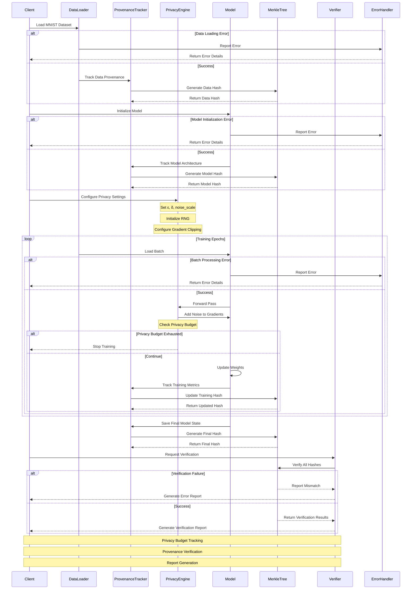
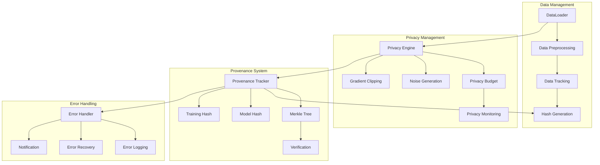
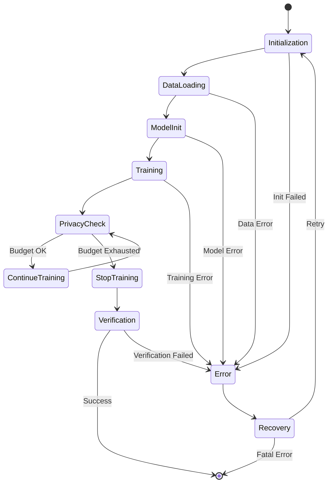
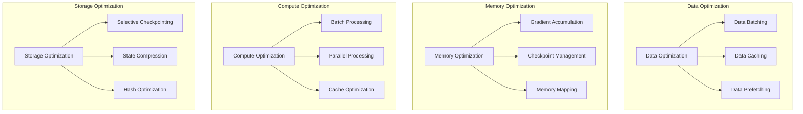
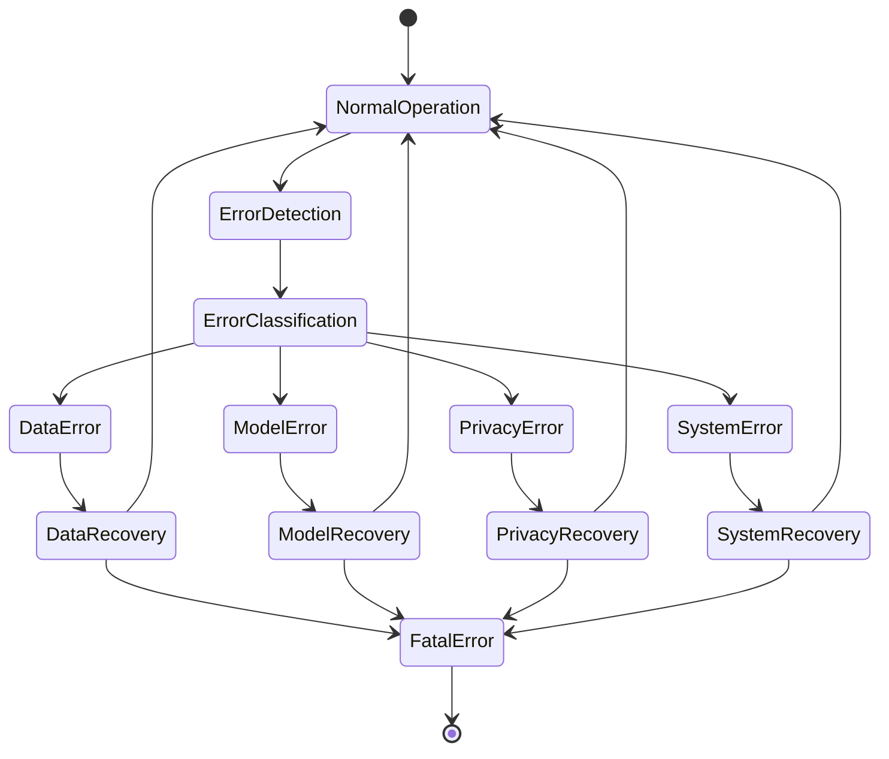
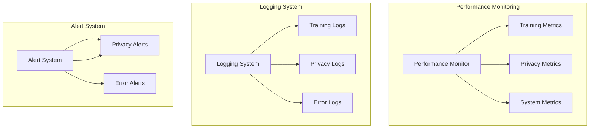
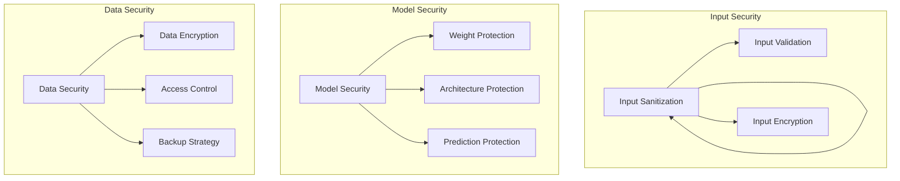

# MNIST Provenance Project Architecture

## 1. System Overview

The MNIST Provenance project is a machine learning system that combines MNIST digit classification with comprehensive provenance tracking and differential privacy. The system is designed to provide:

- Secure and private model training
- Complete provenance tracking
- Verifiable model and data integrity
- Reproducible training runs
- Comprehensive reporting

## 2. System Architecture

### 2.1 High-Level Components

```
MNIST Provenance
├── Training System
│   ├── Model Training
│   ├── Differential Privacy
│   └── Performance Monitoring
├── Provenance System
│   ├── Data Provenance
│   ├── Model Provenance
│   ├── Training Provenance
│   └── Merkle Tree Verification
└── Reporting System
    ├── Training Reports
    ├── Verification Reports
    └── Privacy Reports
```

### 2.2 Component Details

#### Training System
- **Model Training**: PyTorch-based MNIST classifier
- **Differential Privacy**: Opacus integration for privacy-preserving training
- **Performance Monitoring**: Real-time tracking of accuracy and loss

#### Provenance System
- **Data Provenance**: Tracks data sources, transformations, and hashes
- **Model Provenance**: Records model architecture, weights, and configurations
- **Training Provenance**: Captures training parameters, metrics, and privacy settings
- **Merkle Tree**: Ensures data integrity through cryptographic verification

#### Reporting System
- **Training Reports**: Comprehensive training summaries
- **Verification Reports**: Integrity verification results
- **Privacy Reports**: Privacy guarantees and metrics

## 3. Data Flow

### 3.1 Training Flow
1. Data Loading and Preprocessing
   - Load MNIST dataset
   - Apply transformations
   - Track data provenance

2. Model Training
   - Initialize model with privacy settings
   - Train with differential privacy
   - Track model and training provenance

3. Verification and Reporting
   - Generate verification proofs
   - Create comprehensive reports
   - Store artifacts and metadata

### 3.2 Provenance Flow
1. Data Provenance
   ```
   Raw Data → Preprocessing → Training Data
   ↓
   Hash Generation → Merkle Tree → Verification
   ```

2. Model Provenance
   ```
   Model Architecture → Weights → Training Config
   ↓
   Hash Generation → Merkle Tree → Verification
   ```

3. Training Provenance
   ```
   Training Run → Metrics → Privacy Settings
   ↓
   Hash Generation → Merkle Tree → Verification
   ```

### 3.3 Training Pipeline Sequence



### 3.4 Component Interaction Details



### 3.5 Error Handling and Recovery



### 3.6 Technical Details

#### 3.6.1 Privacy Engine Configuration
```python
privacy_engine_config = {
    "target_epsilon": 8.0,        # Target privacy budget
    "target_delta": 1e-5,         # Failure probability
    "noise_multiplier": 1.1,      # Noise scale
    "max_grad_norm": 1.0,         # Gradient clipping
    "secure_rng": True,           # Secure random number generation
    "accounting_mechanism": "rdp" # Renyi Differential Privacy
}
```

#### 3.6.2 Provenance Tracking Details
```python
provenance_config = {
    "hash_algorithm": "sha256",   # Hash function
    "merkle_tree_depth": 32,      # Tree depth
    "batch_tracking": True,       # Track per-batch
    "privacy_tracking": True,     # Track privacy metrics
    "verification_frequency": 10  # Verify every N batches
}
```

#### 3.6.3 Error Recovery Strategies
1. **Data Loading Errors**
   - Retry with exponential backoff
   - Fallback to cached data
   - Validate data integrity

2. **Model Errors**
   - Checkpoint recovery
   - Architecture validation
   - Weight initialization verification

3. **Privacy Budget Errors**
   - Early stopping
   - Budget reallocation
   - Privacy-preserving fallback

4. **Verification Failures**
   - Hash recomputation
   - Merkle tree reconstruction
   - Component isolation

### 3.7 Edge Cases and Mitigations

1. **Privacy Budget Exhaustion**
   - Implement early stopping
   - Save intermediate checkpoints
   - Report privacy metrics

2. **Hash Collisions**
   - Use multiple hash functions
   - Implement collision detection
   - Maintain hash history

3. **Memory Constraints**
   - Batch size adjustment
   - Gradient accumulation
   - Memory-efficient tracking

4. **Training Interruptions**
   - Checkpoint management
   - State recovery
   - Resume capability

### 3.8 Implementation Details

#### 3.8.1 Model Architecture Implementation
```python
class MNISTModel(nn.Module):
    def __init__(self):
        super().__init__()
        self.conv1 = nn.Conv2d(1, 32, 3, 1)
        self.conv2 = nn.Conv2d(32, 64, 3, 1)
        self.dropout1 = nn.Dropout(0.25)
        self.dropout2 = nn.Dropout(0.5)
        self.fc1 = nn.Linear(9216, 128)
        self.fc2 = nn.Linear(128, 10)

    def forward(self, x):
        x = self.conv1(x)
        x = F.relu(x)
        x = self.conv2(x)
        x = F.relu(x)
        x = F.max_pool2d(x, 2)
        x = self.dropout1(x)
        x = torch.flatten(x, 1)
        x = self.fc1(x)
        x = F.relu(x)
        x = self.dropout2(x)
        x = self.fc2(x)
        return F.log_softmax(x, dim=1)
```

#### 3.8.2 Privacy Engine Implementation
```python
class PrivacyManager:
    def __init__(self, config):
        self.epsilon = config["target_epsilon"]
        self.delta = config["target_delta"]
        self.noise_multiplier = config["noise_multiplier"]
        self.max_grad_norm = config["max_grad_norm"]
        self.secure_rng = config["secure_rng"]
        
    def add_noise(self, gradients):
        # Clip gradients
        grad_norm = torch.norm(gradients)
        if grad_norm > self.max_grad_norm:
            gradients = gradients * (self.max_grad_norm / grad_norm)
        
        # Add noise
        noise = torch.randn_like(gradients) * self.noise_multiplier
        return gradients + noise
```

#### 3.8.3 Provenance Tracking Implementation
```python
class ProvenanceManager:
    def __init__(self, config):
        self.hash_algorithm = config["hash_algorithm"]
        self.merkle_tree = MLProvenanceMerkleTree(depth=config["merkle_tree_depth"])
        self.batch_tracking = config["batch_tracking"]
        
    def track_batch(self, batch_data, batch_metrics):
        batch_hash = self._generate_hash({
            "data": batch_data,
            "metrics": batch_metrics
        })
        self.merkle_tree.add_node(batch_hash)
        return batch_hash
```

### 3.9 Performance Optimization



#### 3.9.1 Optimization Strategies

1. **Data Pipeline Optimization**
   ```python
   class OptimizedDataLoader:
       def __init__(self):
           self.cache = {}
           self.prefetch_queue = Queue(maxsize=3)
           
       def prefetch_data(self):
           while True:
               batch = self._load_next_batch()
               self.prefetch_queue.put(batch)
               
       def get_batch(self):
           return self.prefetch_queue.get()
   ```

2. **Memory Management**
   ```python
   class MemoryManager:
       def __init__(self):
           self.checkpoints = {}
           self.gradient_buffer = []
           
       def accumulate_gradients(self, gradients):
           self.gradient_buffer.append(gradients)
           if len(self.gradient_buffer) >= self.accumulation_steps:
               self._apply_gradients()
   ```

3. **Compute Optimization**
   ```python
   class ComputeOptimizer:
       def __init__(self):
           self.batch_size = self._optimize_batch_size()
           self.num_workers = self._optimize_workers()
           
       def _optimize_batch_size(self):
           # Dynamic batch size optimization
           return optimal_batch_size
   ```

### 3.10 Advanced Error Handling



#### 3.10.1 Error Handling Implementation
```python
class ErrorHandler:
    def __init__(self):
        self.error_log = []
        self.recovery_strategies = {
            "data_error": self._handle_data_error,
            "model_error": self._handle_model_error,
            "privacy_error": self._handle_privacy_error,
            "system_error": self._handle_system_error
        }
    
    def handle_error(self, error_type, error_details):
        strategy = self.recovery_strategies.get(error_type)
        if strategy:
            return strategy(error_details)
        return self._handle_unknown_error(error_details)
    
    def _handle_data_error(self, details):
        # Implement data error recovery
        pass
    
    def _handle_model_error(self, details):
        # Implement model error recovery
        pass
```

### 3.11 Monitoring and Logging



#### 3.11.1 Monitoring Implementation
```python
class SystemMonitor:
    def __init__(self):
        self.metrics = {
            "training": defaultdict(list),
            "privacy": defaultdict(list),
            "system": defaultdict(list)
        }
        
    def track_metric(self, category, name, value):
        self.metrics[category][name].append(value)
        
    def generate_report(self):
        return {
            "training": self._analyze_training_metrics(),
            "privacy": self._analyze_privacy_metrics(),
            "system": self._analyze_system_metrics()
        }
```

### 3.12 Security Enhancements



#### 3.12.1 Security Implementation
```python
class SecurityManager:
    def __init__(self):
        self.encryption_key = self._generate_key()
        self.access_control = AccessControl()
        
    def protect_model(self, model):
        # Implement model protection
        pass
    
    def protect_data(self, data):
        # Implement data protection
        pass
```

## 4. Security and Privacy

### 4.1 Differential Privacy
- **Implementation**: Opacus library
- **Privacy Parameters**:
  - Epsilon (ε): Privacy budget
  - Delta (δ): Failure probability
  - Noise scale: Gradient clipping and noise addition

### 4.2 Data Integrity
- **Hash Generation**: SHA-256 for all components
- **Merkle Tree**: Cryptographic verification
- **Verification Process**: Multi-level integrity checks

## 5. File Structure

```
mnist_provenance/
├── src/
│   ├── training/
│   │   ├── train.py          # Training logic
│   │   └── model.py          # Model architecture
│   ├── provenance/
│   │   ├── tracker.py        # Provenance tracking
│   │   ├── verifier.py       # Verification logic
│   │   ├── merkle_tree.py    # Merkle tree implementation
│   │   └── generate_final_report.py  # Report generation
│   └── utils/
│       └── setup.py          # Utility functions
├── data/
│   ├── raw/                  # Raw MNIST data
│   └── processed/            # Processed datasets
├── artifacts/
│   ├── models/              # Saved models
│   └── provenance/          # Provenance data
└── scripts/
    └── run_training.sh      # Training script
```

## 6. Key Components

### 6.1 Model Architecture
```python
class MNISTModel(nn.Module):
    - Convolutional layers
    - Pooling layers
    - Fully connected layers
    - Dropout for regularization
```

### 6.2 Provenance Tracking
```python
class ProvenanceTracker:
    - Data tracking
    - Model tracking
    - Training tracking
    - Hash generation
    - Merkle tree integration
```

### 6.3 Verification System
```python
class ProvenanceVerifier:
    - Hash verification
    - Merkle proof verification
    - Component verification
    - Report generation
```

## 7. Dependencies

### 7.1 Core Dependencies
- PyTorch: Deep learning framework
- Opacus: Differential privacy
- NumPy: Numerical computations
- Pandas: Data manipulation

### 7.2 Development Dependencies
- Python 3.11+
- Virtual environment management
- Git for version control

## 8. Configuration

### 8.1 Training Configuration
- Batch size
- Learning rate
- Number of epochs
- Privacy parameters

### 8.2 Provenance Configuration
- Hash algorithms
- Merkle tree parameters
- Verification settings

## 9. Reporting

### 9.1 Training Reports
- Training metrics
- Model performance
- Privacy guarantees
- System information

### 9.2 Verification Reports
- Hash verification results
- Merkle proof verification
- Component verification
- Overall status

## 10. Future Enhancements

### 10.1 Planned Features
- Distributed training support
- Enhanced privacy mechanisms
- Extended verification capabilities
- Advanced reporting features

### 10.2 Potential Improvements
- Real-time monitoring
- Automated testing
- Performance optimization
- Enhanced security features

## 11. Best Practices

### 11.1 Development
- Code documentation
- Type hints
- Error handling
- Logging

### 11.2 Security
- Privacy-first design
- Secure hash generation
- Verification at all levels
- Regular security audits

### 11.3 Performance
- Efficient data loading
- Optimized training
- Minimal overhead
- Resource management

## 12. Troubleshooting

### 12.1 Common Issues
- Hash verification failures
- Privacy budget exhaustion
- Memory management
- Performance bottlenecks

### 12.2 Solutions
- Detailed logging
- Verification debugging
- Resource optimization
- Performance monitoring 