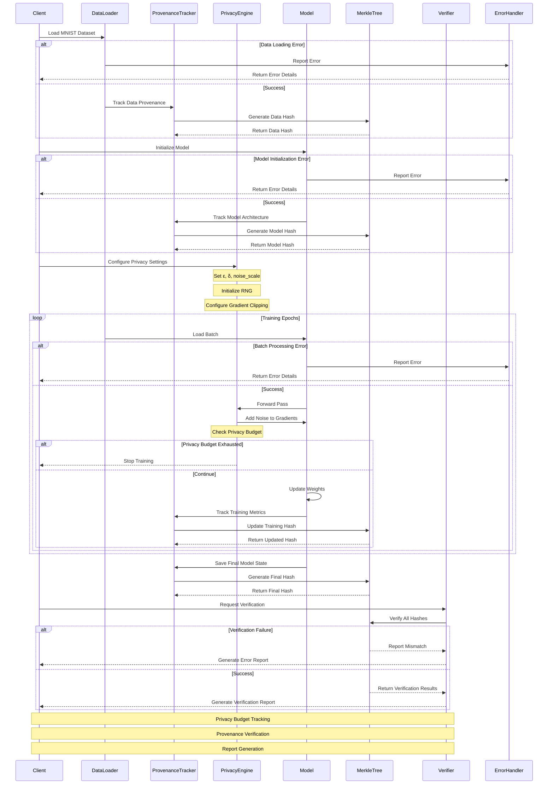
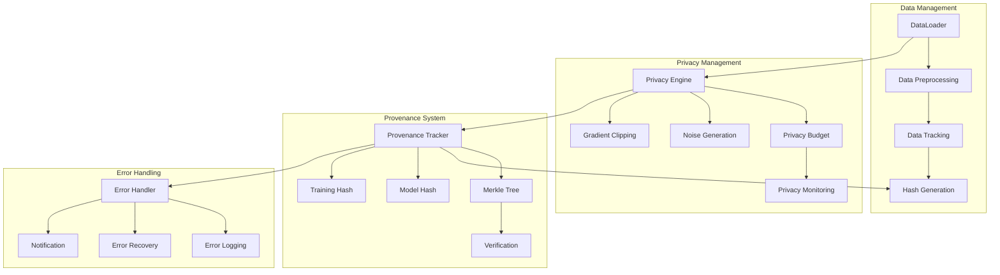
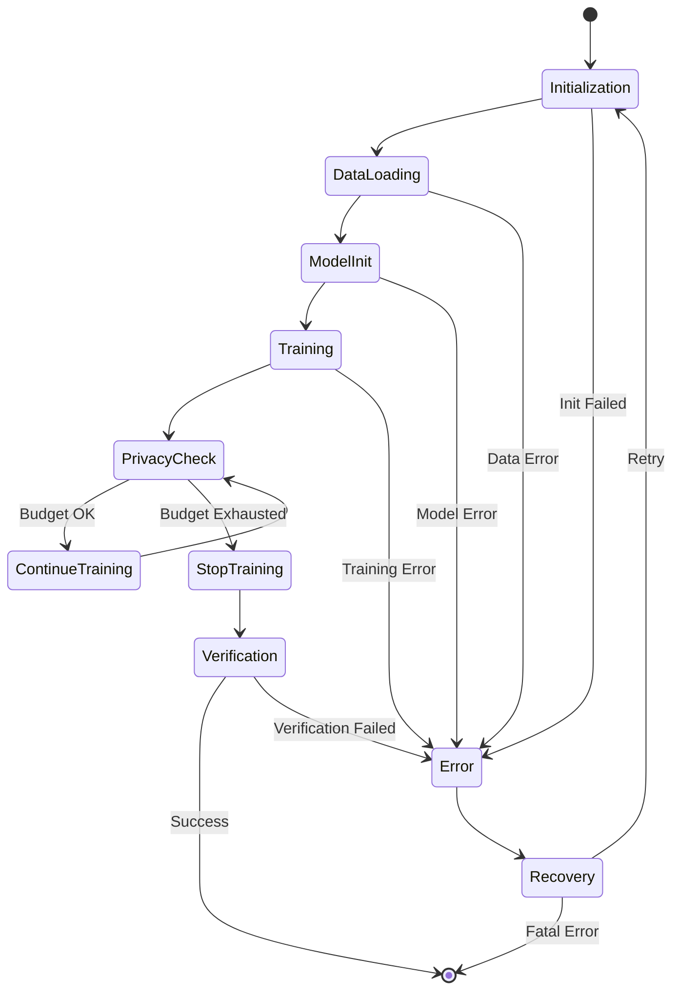
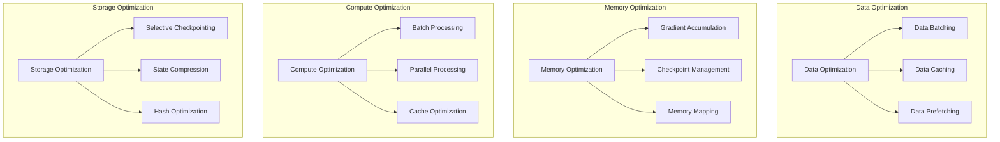
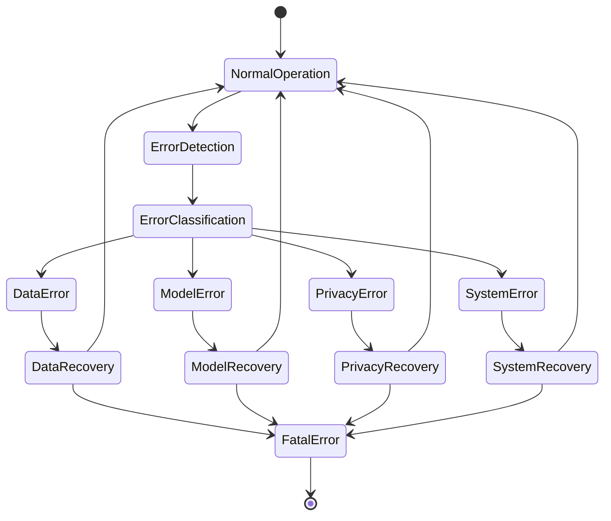
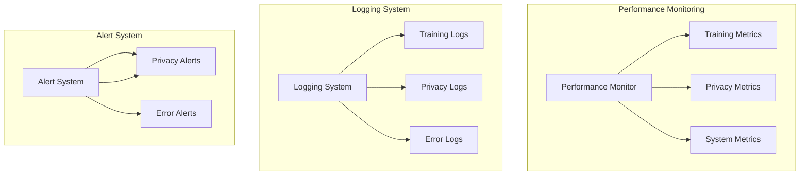
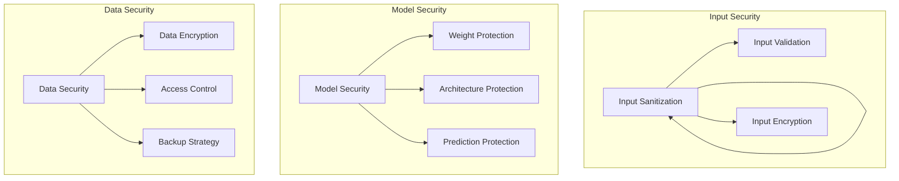
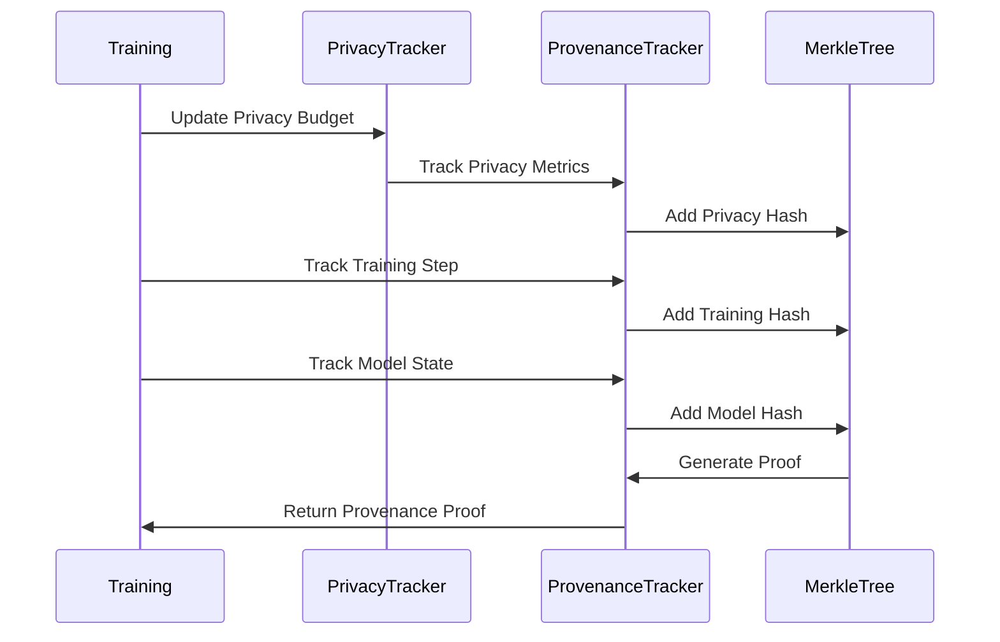

# MNIST Provenance Project Architecture

## 1. System Overview

The MNIST Provenance project is a machine learning system that combines MNIST digit classification with comprehensive provenance tracking and differential privacy. The system is designed to provide:

- Secure and private model training
- Complete provenance tracking
- Verifiable model and data integrity
- Reproducible training runs
- Comprehensive reporting

## 2. System Architecture

### 2.1 High-Level Components

```
MNIST Provenance
├── Training System
│   ├── Model Training
│   ├── Differential Privacy
│   └── Performance Monitoring
├── Provenance System
│   ├── Data Provenance
│   ├── Model Provenance
│   ├── Training Provenance
│   └── Merkle Tree Verification
└── Reporting System
    ├── Training Reports
    ├── Verification Reports
    └── Privacy Reports
```

### 2.2 Component Details

#### Training System
- **Model Training**: PyTorch-based MNIST classifier
- **Differential Privacy**: Opacus integration for privacy-preserving training
- **Performance Monitoring**: Real-time tracking of accuracy and loss

#### Provenance System
- **Data Provenance**: Tracks data sources, transformations, and hashes
- **Model Provenance**: Records model architecture, weights, and configurations
- **Training Provenance**: Captures training parameters, metrics, and privacy settings
- **Merkle Tree**: Ensures data integrity through cryptographic verification

### Model State Changes and Verification

#### Model State Evolution During Training
1. **Initial State**:
   - Model starts with randomly initialized weights
   - No learned knowledge
   - Weights are typically small random numbers

2. **During Training**:
   - Weights update after each batch
   - Changes are proportional to learning rate
   - Updates minimize the loss function
   - Model goes through multiple states:
     - Training mode (dropout, batch normalization active)
     - Evaluation mode (dropout disabled)

3. **State Changes**:
   - Weights change after every batch
   - Changes are cumulative across epochs
   - Different modes affect model behavior

#### Verification Approach
1. **Architecture Verification**:
   - Verify model structure hasn't changed
   - Check layer types and connections
   - Ensure no layers were added/removed

2. **Training Progress Verification**:
   - Verify loss decreased over time
   - Check accuracy improved
   - Confirm training completed all epochs

3. **Final State Verification**:
   - Verify final model performance
   - Check if model meets accuracy thresholds
   - Ensure model is in evaluation mode

4. **Weight Change Verification**:
   - Verify weights changed from initial state
   - Check if changes are within expected ranges
   - Confirm no weights became NaN or infinite

#### Why This Matters
- **Reproducibility**: Ensures training process is reproducible
- **Integrity**: Verifies no malicious changes occurred
- **Progress**: Confirms model actually learned
- **Quality**: Ensures model meets performance requirements

Note: Model state changes are not just expected but required for successful training. The verification system should verify these changes are appropriate and beneficial, rather than treating any change as a failure.

#### Reporting System
- **Training Reports**: Comprehensive training summaries
- **Verification Reports**: Integrity verification results
- **Privacy Reports**: Privacy guarantees and metrics

## 3. Data Flow

### 3.1 Training Flow
1. Data Loading and Preprocessing
   - Load MNIST dataset
   - Apply transformations
   - Track data provenance

2. Model Training
   - Initialize model with privacy settings
   - Train with differential privacy
   - Track model and training provenance

3. Verification and Reporting
   - Generate verification proofs
   - Create comprehensive reports
   - Store artifacts and metadata

### 3.2 Provenance Flow
1. Data Provenance
   ```
   Raw Data → Preprocessing → Training Data
   ↓
   Hash Generation → Merkle Tree → Verification
   ```

2. Model Provenance
   ```
   Model Architecture → Weights → Training Config
   ↓
   Hash Generation → Merkle Tree → Verification
   ```

3. Training Provenance
   ```
   Training Run → Metrics → Privacy Settings
   ↓
   Hash Generation → Merkle Tree → Verification
   ```

### 3.3 Training Pipeline Sequence



### 3.4 Component Interaction Details



### 3.5 Error Handling and Recovery



### 3.6 Technical Details

#### 3.6.1 Privacy Engine Configuration
```python
privacy_engine_config = {
    "target_epsilon": 8.0,        # Target privacy budget
    "target_delta": 1e-5,         # Failure probability
    "noise_multiplier": 1.1,      # Noise scale
    "max_grad_norm": 1.0,         # Gradient clipping
    "secure_rng": True,           # Secure random number generation
    "accounting_mechanism": "rdp" # Renyi Differential Privacy
}
```

#### 3.6.2 Provenance Tracking Details
```python
provenance_config = {
    "hash_algorithm": "sha256",   # Hash function (options: sha256, blake3, sha512)
    "merkle_tree_depth": 32,      # Tree depth
    "batch_tracking": True,       # Track per-batch
    "privacy_tracking": True,     # Track privacy metrics
    "verification_frequency": 10  # Verify every N batches
}
```

#### 3.6.3 Hash Function Configuration
The system supports multiple hash algorithms through the `HashConfig` and `HashFactory` classes:

1. **Supported Algorithms**:
   - SHA-256 (default)
   - BLAKE3
   - SHA-512

2. **Configuration**:
```python
from ml_provenance.provenance.hash_config import HashFactory

# Initialize with preferred algorithm
HashFactory.initialize(hash_algorithm="blake3")  # or "sha256" or "sha512"

# Get current algorithm
current_algorithm = HashFactory.get_current_algorithm()
```

3. **Usage**:
   - The configured hash function is used consistently across all components
   - Affects data hashing, model architecture hashing, training process hashing
   - Used in Merkle tree node computation
   - Thread-safe through factory pattern

#### 3.6.4 Merkle Tree Verification
The system implements a Merkle tree for comprehensive provenance verification:

1. **Tree Structure**:
   - Root node contains hash of entire provenance
   - Left subtree: Data provenance (train/test data)
   - Right subtree: Model and training information
   - Each node contains its own hash and references to children

2. **Verification Process**:
   - Component-wise verification (data, model, training)
   - Hash matching at each level
   - Architecture validation
   - Training progression tracking
   - Privacy budget verification

3. **Model Progression Tracking**:
   - Architecture changes during training
   - Weight updates and gradients
   - Performance metrics per epoch
   - Privacy budget consumption
   - Training configuration changes

#### 3.6.5 Report Generation
The system now includes comprehensive reporting capabilities:

1. **Unified Report**:
   - HTML-based visualization
   - Performance metrics plots
   - Privacy budget consumption
   - Training progression
   - Verification status
   - Hash information

2. **Detailed Provenance Report**:
   - Run-specific information
   - Data verification details
   - Model architecture and parameters
   - Training configuration
   - Privacy parameters
   - Training history
   - Final metrics
   - Hash structure

3. **Report Features**:
   - Interactive HTML tables
   - Performance plots
   - Privacy budget visualization
   - Merkle tree structure
   - Verification status indicators
   - Component-wise hash information

#### 3.6.6 Error Recovery Strategies
1. **Data Loading Errors**
   - Retry with exponential backoff
   - Fallback to cached data
   - Validate data integrity

2. **Model Errors**
   - Checkpoint recovery
   - Architecture validation
   - Weight initialization verification

3. **Privacy Budget Errors**
   - Early stopping
   - Budget reallocation
   - Privacy-preserving fallback

4. **Verification Failures**
   - Hash recomputation
   - Merkle tree reconstruction
   - Component isolation

### 3.7 Edge Cases and Mitigations

1. **Privacy Budget Exhaustion**
   - Implement early stopping
   - Save intermediate checkpoints
   - Report privacy metrics

2. **Hash Collisions**
   - Use multiple hash functions
   - Implement collision detection
   - Maintain hash history

3. **Memory Constraints**
   - Batch size adjustment
   - Gradient accumulation
   - Memory-efficient tracking

4. **Training Interruptions**
   - Checkpoint management
   - State recovery
   - Resume capability

### 3.8 Implementation Details

#### 3.8.1 Model Architecture Implementation
```python
class MNISTModel(nn.Module):
    def __init__(self):
        super().__init__()
        self.conv1 = nn.Conv2d(1, 32, 3, 1)
        self.conv2 = nn.Conv2d(32, 64, 3, 1)
        self.dropout1 = nn.Dropout(0.25)
        self.dropout2 = nn.Dropout(0.5)
        self.fc1 = nn.Linear(9216, 128)
        self.fc2 = nn.Linear(128, 10)

    def forward(self, x):
        x = self.conv1(x)
        x = F.relu(x)
        x = self.conv2(x)
        x = F.relu(x)
        x = F.max_pool2d(x, 2)
        x = self.dropout1(x)
        x = torch.flatten(x, 1)
        x = self.fc1(x)
        x = F.relu(x)
        x = self.dropout2(x)
        x = self.fc2(x)
        return F.log_softmax(x, dim=1)
```

#### 3.8.2 Privacy Engine Implementation
```python
class PrivacyManager:
    def __init__(self, config):
        self.epsilon = config["target_epsilon"]
        self.delta = config["target_delta"]
        self.noise_multiplier = config["noise_multiplier"]
        self.max_grad_norm = config["max_grad_norm"]
        self.secure_rng = config["secure_rng"]
        
    def add_noise(self, gradients):
        # Clip gradients
        grad_norm = torch.norm(gradients)
        if grad_norm > self.max_grad_norm:
            gradients = gradients * (self.max_grad_norm / grad_norm)
        
        # Add noise
        noise = torch.randn_like(gradients) * self.noise_multiplier
        return gradients + noise
```

#### 3.8.3 Provenance Tracking Implementation
```python
class ProvenanceManager:
    def __init__(self, config):
        self.hash_algorithm = config["hash_algorithm"]
        self.merkle_tree = MLProvenanceMerkleTree(depth=config["merkle_tree_depth"])
        self.batch_tracking = config["batch_tracking"]
        
    def track_batch(self, batch_data, batch_metrics):
        batch_hash = self._generate_hash({
            "data": batch_data,
            "metrics": batch_metrics
        })
        self.merkle_tree.add_node(batch_hash)
        return batch_hash
```

### 3.9 Performance Optimization



#### 3.9.1 Optimization Strategies

1. **Data Pipeline Optimization**
   ```python
   class OptimizedDataLoader:
       def __init__(self):
           self.cache = {}
           self.prefetch_queue = Queue(maxsize=3)
           
       def prefetch_data(self):
           while True:
               batch = self._load_next_batch()
               self.prefetch_queue.put(batch)
               
       def get_batch(self):
           return self.prefetch_queue.get()
   ```

2. **Memory Management**
   ```python
   class MemoryManager:
       def __init__(self):
           self.checkpoints = {}
           self.gradient_buffer = []
           
       def accumulate_gradients(self, gradients):
           self.gradient_buffer.append(gradients)
           if len(self.gradient_buffer) >= self.accumulation_steps:
               self._apply_gradients()
   ```

3. **Compute Optimization**
   ```python
   class ComputeOptimizer:
       def __init__(self):
           self.batch_size = self._optimize_batch_size()
           self.num_workers = self._optimize_workers()
           
       def _optimize_batch_size(self):
           # Dynamic batch size optimization
           return optimal_batch_size
   ```

### 3.10 Advanced Error Handling



#### 3.10.1 Error Handling Implementation
```python
class ErrorHandler:
    def __init__(self):
        self.error_log = []
        self.recovery_strategies = {
            "data_error": self._handle_data_error,
            "model_error": self._handle_model_error,
            "privacy_error": self._handle_privacy_error,
            "system_error": self._handle_system_error
        }
    
    def handle_error(self, error_type, error_details):
        strategy = self.recovery_strategies.get(error_type)
        if strategy:
            return strategy(error_details)
        return self._handle_unknown_error(error_details)
    
    def _handle_data_error(self, details):
        # Implement data error recovery
        pass
    
    def _handle_model_error(self, details):
        # Implement model error recovery
        pass
```

### 3.11 Monitoring and Logging



#### 3.11.1 Monitoring Implementation
```python
class SystemMonitor:
    def __init__(self):
        self.metrics = {
            "training": defaultdict(list),
            "privacy": defaultdict(list),
            "system": defaultdict(list)
        }
        
    def track_metric(self, category, name, value):
        self.metrics[category][name].append(value)
        
    def generate_report(self):
        return {
            "training": self._analyze_training_metrics(),
            "privacy": self._analyze_privacy_metrics(),
            "system": self._analyze_system_metrics()
        }
```

### 3.12 Security Enhancements



#### 3.12.1 Security Implementation
```python
class SecurityManager:
    def __init__(self):
        self.encryption_key = self._generate_key()
        self.access_control = AccessControl()
        
    def protect_model(self, model):
        # Implement model protection
        pass
    
    def protect_data(self, data):
        # Implement data protection
        pass
```

### 3.13 Privacy Budget Tracking

#### 3.13.1 Privacy Budget Implementation
```python
class PrivacyBudgetTracker:
    def __init__(self, target_epsilon, target_delta):
        self.target_epsilon = target_epsilon
        self.target_delta = target_delta
        self.current_epsilon = 0.0
        self.current_delta = target_delta
        self.steps_taken = 0
        self.budget_history = []
        
    def update_budget(self, noise_multiplier, batch_size, dataset_size):
        """Update privacy budget using RDP (Renyi Differential Privacy) accounting."""
        # Calculate privacy cost for this step
        step_epsilon = self._calculate_step_epsilon(
            noise_multiplier, 
            batch_size, 
            dataset_size
        )
        
        # Update total privacy budget
        self.current_epsilon = self._compose_epsilons(
            self.current_epsilon, 
            step_epsilon
        )
        
        # Record budget usage
        self.budget_history.append({
            'step': self.steps_taken,
            'epsilon': self.current_epsilon,
            'delta': self.current_delta,
            'noise_multiplier': noise_multiplier
        })
        
        self.steps_taken += 1
        return self._check_budget_exhaustion()
    
    def _calculate_step_epsilon(self, noise_multiplier, batch_size, dataset_size):
        """Calculate privacy cost for a single step using RDP."""
        # Implementation of RDP accounting
        sampling_rate = batch_size / dataset_size
        return self._rdp_to_eps(
            self._compute_rdp(
                sampling_rate,
                noise_multiplier,
                self.steps_taken
            )
        )
    
    def _check_budget_exhaustion(self):
        """Check if privacy budget is exhausted."""
        return {
            'budget_exhausted': self.current_epsilon >= self.target_epsilon,
            'remaining_budget': self.target_epsilon - self.current_epsilon,
            'current_epsilon': self.current_epsilon,
            'current_delta': self.current_delta
        }
```

#### 3.13.2 Privacy Budget Monitoring
```python
class PrivacyMonitor:
    def __init__(self, budget_tracker):
        self.budget_tracker = budget_tracker
        self.alerts = []
        
    def monitor_step(self, step_metrics):
        """Monitor privacy budget usage during training."""
        budget_status = self.budget_tracker.update_budget(
            step_metrics['noise_multiplier'],
            step_metrics['batch_size'],
            step_metrics['dataset_size']
        )
        
        if budget_status['budget_exhausted']:
            self.alerts.append({
                'type': 'budget_exhaustion',
                'step': step_metrics['step'],
                'details': budget_status
            })
            
        return budget_status
```

### 3.14 Provenance Tracking Implementation

#### 3.14.1 Core Provenance Tracking
```python
class ProvenanceTracker:
    def __init__(self, config):
        self.config = config
        self.merkle_tree = MLProvenanceMerkleTree()
        self.provenance_data = {
            'data': {},
            'model': {},
            'training': {},
            'privacy': {}
        }
        
    def track_data_provenance(self, data_info):
        """Track data provenance information."""
        data_hash = self._generate_hash(data_info)
        self.provenance_data['data'] = {
            'hash': data_hash,
            'timestamp': datetime.now().isoformat(),
            'info': data_info
        }
        self.merkle_tree.add_node(data_hash)
        return data_hash
        
    def track_model_provenance(self, model_info):
        """Track model architecture and weights."""
        model_hash = self._generate_hash(model_info)
        self.provenance_data['model'] = {
            'hash': model_hash,
            'timestamp': datetime.now().isoformat(),
            'info': model_info
        }
        self.merkle_tree.add_node(model_hash)
        return model_hash
        
    def track_training_provenance(self, training_info):
        """Track training process and metrics."""
        training_hash = self._generate_hash(training_info)
        self.provenance_data['training'] = {
            'hash': training_hash,
            'timestamp': datetime.now().isoformat(),
            'info': training_info
        }
        self.merkle_tree.add_node(training_hash)
        return training_hash
```

#### 3.14.2 Provenance Proof Generation
```python
class ProvenanceProofGenerator:
    def __init__(self, merkle_tree):
        self.merkle_tree = merkle_tree
        
    def generate_proof(self, component_hash):
        """Generate Merkle proof for a component."""
        proof = self.merkle_tree.generate_proof(component_hash)
        return {
            'component_hash': component_hash,
            'proof': proof,
            'root_hash': self.merkle_tree.get_root_hash(),
            'timestamp': datetime.now().isoformat()
        }
        
    def verify_proof(self, proof):
        """Verify a Merkle proof."""
        return self.merkle_tree.verify_proof(
            proof['component_hash'],
            proof['proof'],
            proof['root_hash']
        )
```

### 3.15 Merkle Tree Implementation

#### 3.15.1 Merkle Tree Structure
```python
class MLProvenanceMerkleTree:
    def __init__(self, depth=32):
        self.depth = depth
        self.nodes = {}
        self.root_hash = None
        
    def add_node(self, hash_value):
        """Add a new node to the Merkle tree."""
        # Generate leaf node
        leaf_node = {
            'hash': hash_value,
            'level': 0,
            'index': len(self.nodes)
        }
        self.nodes[leaf_node['index']] = leaf_node
        
        # Update tree
        self._update_tree()
        
    def _update_tree(self):
        """Update the Merkle tree after adding a node."""
        current_level = 0
        while current_level < self.depth:
            # Get nodes at current level
            level_nodes = [
                node for node in self.nodes.values()
                if node['level'] == current_level
            ]
            
            # Create parent nodes
            for i in range(0, len(level_nodes), 2):
                if i + 1 < len(level_nodes):
                    parent_hash = self._hash_pair(
                        level_nodes[i]['hash'],
                        level_nodes[i + 1]['hash']
                    )
                else:
                    parent_hash = level_nodes[i]['hash']
                    
                parent_node = {
                    'hash': parent_hash,
                    'level': current_level + 1,
                    'index': len(self.nodes)
                }
                self.nodes[parent_node['index']] = parent_node
                
            current_level += 1
            
        # Update root hash
        root_nodes = [
            node for node in self.nodes.values()
            if node['level'] == self.depth - 1
        ]
        if root_nodes:
            self.root_hash = root_nodes[0]['hash']
```

#### 3.15.2 Proof Generation and Verification
```python
class MerkleProof:
    def __init__(self, merkle_tree):
        self.merkle_tree = merkle_tree
        
    def generate_proof(self, leaf_hash):
        """Generate a Merkle proof for a leaf node."""
        # Find leaf node
        leaf_node = next(
            (node for node in self.merkle_tree.nodes.values()
             if node['hash'] == leaf_hash and node['level'] == 0),
            None
        )
        
        if not leaf_node:
            raise ValueError("Leaf hash not found in tree")
            
        proof = []
        current_node = leaf_node
        
        # Build proof path
        while current_node['level'] < self.merkle_tree.depth - 1:
            # Find sibling
            sibling = self._find_sibling(current_node)
            if sibling:
                proof.append({
                    'hash': sibling['hash'],
                    'position': 'left' if sibling['index'] > current_node['index'] else 'right'
                })
                
            # Move to parent
            current_node = self._find_parent(current_node)
            
        return proof
        
    def verify_proof(self, leaf_hash, proof, root_hash):
        """Verify a Merkle proof."""
        current_hash = leaf_hash
        
        for step in proof:
            if step['position'] == 'left':
                current_hash = self._hash_pair(step['hash'], current_hash)
            else:
                current_hash = self._hash_pair(current_hash, step['hash'])
                
        return current_hash == root_hash
```

### 3.16 Privacy and Provenance Integration



#### 3.16.1 Integration Implementation
```python
class PrivacyProvenanceManager:
    def __init__(self):
        self.privacy_tracker = PrivacyBudgetTracker(
            target_epsilon=8.0,
            target_delta=1e-5
        )
        self.provenance_tracker = ProvenanceTracker(config={
            'hash_algorithm': 'sha256',
            'merkle_tree_depth': 32
        })
        self.proof_generator = ProvenanceProofGenerator(
            self.provenance_tracker.merkle_tree
        )
        
    def track_training_step(self, step_info):
        """Track both privacy and provenance for a training step."""
        # Track privacy budget
        privacy_status = self.privacy_tracker.update_budget(
            step_info['noise_multiplier'],
            step_info['batch_size'],
            step_info['dataset_size']
        )
        
        # Track provenance
        provenance_info = {
            'step': step_info['step'],
            'privacy': privacy_status,
            'metrics': step_info['metrics'],
            'model_state': step_info['model_state']
        }
        
        # Generate proof
        proof = self.proof_generator.generate_proof(
            self.provenance_tracker.track_training_provenance(provenance_info)
        )
        
        return {
            'privacy_status': privacy_status,
            'provenance_proof': proof
        }
```

## 4. Security and Privacy

### 4.1 Differential Privacy
- **Implementation**: Opacus library
- **Privacy Parameters**:
  - Epsilon (ε): Privacy budget
  - Delta (δ): Failure probability
  - Noise scale: Gradient clipping and noise addition

### 4.2 Data Integrity
- **Hash Generation**: SHA-256 for all components
- **Merkle Tree**: Cryptographic verification
- **Verification Process**: Multi-level integrity checks

## 5. File Structure

```
mnist_provenance/
├── src/
│   ├── training/
│   │   ├── train.py          # Training logic
│   │   └── model.py          # Model architecture
│   ├── provenance/
│   │   ├── tracker.py        # Provenance tracking
│   │   ├── verifier.py       # Verification logic
│   │   ├── merkle_tree.py    # Merkle tree implementation
│   │   └── generate_final_report.py  # Report generation
│   └── utils/
│       └── setup.py          # Utility functions
├── data/
│   ├── raw/                  # Raw MNIST data
│   └── processed/            # Processed datasets
├── artifacts/
│   ├── models/              # Saved models
│   └── provenance/          # Provenance data
└── scripts/
    └── run_training.sh      # Training script
```

## 6. Key Components

### 6.1 Model Architecture
```python
class MNISTModel(nn.Module):
    - Convolutional layers
    - Pooling layers
    - Fully connected layers
    - Dropout for regularization
```

### 6.2 Provenance Tracking
```python
class ProvenanceTracker:
    - Data tracking
    - Model tracking
    - Training tracking
    - Hash generation
    - Merkle tree integration
```

### 6.3 Verification System
```python
class ProvenanceVerifier:
    - Hash verification
    - Merkle proof verification
    - Component verification
    - Report generation
```

## 7. Dependencies

### 7.1 Core Dependencies
- PyTorch: Deep learning framework
- Opacus: Differential privacy
- NumPy: Numerical computations
- Pandas: Data manipulation

### 7.2 Development Dependencies
- Python 3.11+
- Virtual environment management
- Git for version control

## 8. Configuration

### 8.1 Training Configuration
- Batch size
- Learning rate
- Number of epochs
- Privacy parameters

### 8.2 Provenance Configuration
- Hash algorithms
- Merkle tree parameters
- Verification settings

## 9. Reporting

### 9.1 Training Reports
- Training metrics
- Model performance
- Privacy guarantees
- System information

### 9.2 Verification Reports
- Hash verification results
- Merkle proof verification
- Component verification
- Overall status

## 10. Future Enhancements

### 10.1 Planned Features
- Distributed training support
- Enhanced privacy mechanisms
- Extended verification capabilities
- Advanced reporting features

### 10.2 Potential Improvements
- Real-time monitoring
- Automated testing
- Performance optimization
- Enhanced security features

## 11. Best Practices

### 11.1 Development
- Code documentation
- Type hints
- Error handling
- Logging

### 11.2 Security
- Privacy-first design
- Secure hash generation
- Verification at all levels
- Regular security audits

### 11.3 Performance
- Efficient data loading
- Optimized training
- Minimal overhead
- Resource management

## 12. Troubleshooting

### 12.1 Common Issues
- Hash verification failures
- Privacy budget exhaustion
- Memory management
- Performance bottlenecks

### 12.2 Solutions
- Detailed logging
- Verification debugging
- Resource optimization
- Performance monitoring 