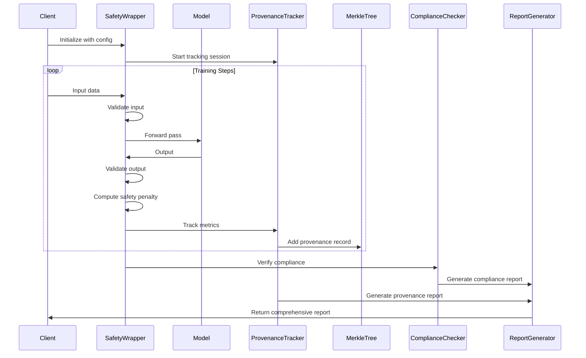
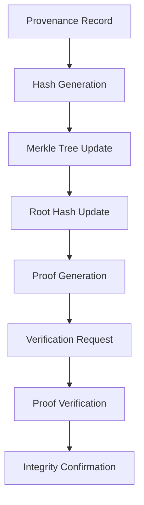

# ML Provenance and Safety Architecture

## Executive Summary

This document presents the architecture for a comprehensive machine learning provenance and safety system designed for production-scale AI deployments. The system provides cryptographic verification of model lineage, automated safety checks, and regulatory compliance across multiple ML frameworks.

## System Architecture Overview

### Core Design Principles

1. **Cryptographic Integrity**: Merkle tree-based provenance verification
2. **Framework Agnostic**: Support for PyTorch, TensorFlow, and JAX
3. **Safety by Design**: Integrated safety mechanisms at every layer
4. **Regulatory Compliance**: Built-in GDPR, CCPA, and industry-specific compliance
5. **Production Ready**: Scalable, fault-tolerant, and monitoring-enabled

### High-Level Architecture

```
┌─────────────────────────────────────────────────────────────┐
│                    ML Provenance & Safety System            │
├─────────────────────────────────────────────────────────────┤
│  Framework Layer (PyTorch/TensorFlow/JAX)                   │
│  ├── Safety Wrappers                                        │
│  ├── Provenance Trackers                                    │
│  └── Compliance Checkers                                    │
├─────────────────────────────────────────────────────────────┤
│  Core Services Layer                                        │
│  ├── Merkle Tree Engine                                     │
│  ├── Safety Validation Engine                               │
│  ├── Privacy Preservation Engine                            │
│  └── Compliance Verification Engine                         │
├─────────────────────────────────────────────────────────────┤
│  Data Layer                                                  │
│  ├── Provenance Storage                                     │
│  ├── Safety Metrics Storage                                 │
│  └── Audit Trail Storage                                    │
└─────────────────────────────────────────────────────────────┘
```

## Core Components

### 1. Framework Integration Layer

The Framework Integration Layer provides safety wrappers for each major ML framework. These wrappers act as middleware that intercepts model inputs and outputs, applying safety checks and provenance tracking without requiring changes to the underlying model code.

#### PyTorch Safety Wrapper

The PyTorch Safety Wrapper is designed to work seamlessly with PyTorch models, providing input/output validation, safety checks, and provenance tracking. It implements a non-intrusive approach that wraps existing PyTorch models without requiring architectural changes.

**Key Features:**
- **Input Validation**: Ensures data types, shapes, and numerical stability
- **Output Validation**: Verifies model outputs meet safety criteria
- **Safety Penalty Computation**: Calculates penalties for safety violations
- **Provenance Tracking**: Records statistics and hashes for audit trails

```python
class PyTorchSafetyWrapper:
    def __init__(self, config: SafetyConfig):
        self.config = config
        self.provenance_tracker = ProvenanceTracker()
        self.safety_validator = SafetyValidator()
        
    def validate_input(self, x: torch.Tensor) -> torch.Tensor:
        """Validate input tensor with safety checks"""
        if not isinstance(x, torch.Tensor):
            raise TypeError("Input must be a PyTorch tensor")
            
        # Numerical stability checks
        if torch.isnan(x).any() or torch.isinf(x).any():
            raise ValueError("Input contains NaN or Inf values")
            
        # Safety validation
        x = self.safety_validator.validate_input(x)
        
        # Provenance tracking
        self.provenance_tracker.track_input_stats({
            'mean': x.mean().item(),
            'std': x.std().item(),
            'shape': x.shape,
            'hash': self._compute_hash(x)
        })
        
        return x
        
    def validate_output(self, output: torch.Tensor) -> torch.Tensor:
        """Validate output tensor with safety checks"""
        if not isinstance(output, torch.Tensor):
            raise TypeError("Output must be a PyTorch tensor")
            
        # Numerical stability checks
        if torch.isnan(output).any() or torch.isinf(output).any():
            raise ValueError("Output contains NaN or Inf values")
            
        # Safety validation
        output = self.safety_validator.validate_output(output)
        
        # Provenance tracking
        self.provenance_tracker.track_output_stats({
            'mean': output.mean().item(),
            'std': output.std().item(),
            'shape': output.shape,
            'hash': self._compute_hash(output)
        })
        
        return output
        
    def compute_safety_penalty(self, output: torch.Tensor) -> torch.Tensor:
        """Compute safety violation penalty"""
        penalty = torch.tensor(0.0, device=output.device)
        
        # Distribution checks
        if self.config.check_distribution:
            penalty += self._check_distribution(output)
            
        # Bias checks
        if self.config.check_bias:
            penalty += self._check_bias(output)
            
        # Privacy checks
        if self.config.check_privacy:
            penalty += self._check_privacy(output)
            
        return penalty
```

**Code Explanation:**
- **`__init__`**: Initializes the wrapper with safety configuration and creates instances of provenance tracker and safety validator
- **`validate_input`**: Performs comprehensive input validation including type checking, numerical stability verification, and safety validation, then tracks input statistics for provenance
- **`validate_output`**: Similar to input validation but for model outputs, ensuring outputs meet safety criteria and tracking output statistics
- **`compute_safety_penalty`**: Calculates penalties for safety violations based on distribution, bias, and privacy checks, which can be incorporated into the training loss

#### TensorFlow Safety Wrapper

The TensorFlow Safety Wrapper provides similar functionality for TensorFlow models, leveraging TensorFlow's graph execution and automatic differentiation capabilities. It uses the `@tf.function` decorator for optimized execution.

**Key Features:**
- **Graph-Optimized Execution**: Uses TensorFlow's graph compilation for performance
- **TensorFlow-Native Operations**: Leverages TensorFlow's built-in validation functions
- **Eager Mode Compatibility**: Works in both eager and graph execution modes
- **Gradient Tape Integration**: Compatible with TensorFlow's automatic differentiation

```python
class TensorFlowSafetyWrapper:
    def __init__(self, config: SafetyConfig):
        self.config = config
        self.provenance_tracker = ProvenanceTracker()
        self.safety_validator = SafetyValidator()
        
    @tf.function
    def validate_input(self, inputs: tf.Tensor) -> tf.Tensor:
        """Validate input tensor with safety checks"""
        if not isinstance(inputs, tf.Tensor):
            raise TypeError("Input must be a TensorFlow tensor")
            
        # Numerical stability checks
        if tf.reduce_any(tf.math.is_nan(inputs)) or tf.reduce_any(tf.math.is_inf(inputs)):
            raise ValueError("Input contains NaN or Inf values")
            
        # Safety validation
        inputs = self.safety_validator.validate_input(inputs)
        
        # Provenance tracking
        self.provenance_tracker.track_input_stats({
            'mean': tf.reduce_mean(inputs).numpy(),
            'std': tf.math.reduce_std(inputs).numpy(),
            'shape': inputs.shape,
            'hash': self._compute_hash(inputs)
        })
        
        return inputs
```

**Code Explanation:**
- **`@tf.function`**: Decorator that compiles the function into a TensorFlow graph for optimized execution
- **`tf.reduce_any`**: TensorFlow's efficient way to check for NaN or Inf values across the entire tensor
- **`tf.math.is_nan/is_inf`**: TensorFlow's built-in functions for detecting numerical instabilities
- **`.numpy()`**: Converts TensorFlow tensors to NumPy arrays for storage and serialization

#### JAX Safety Wrapper

The JAX Safety Wrapper is designed for high-performance computing scenarios, leveraging JAX's JIT compilation and functional programming paradigm. It's optimized for large-scale training and inference.

**Key Features:**
- **JIT Compilation**: Uses JAX's just-in-time compilation for maximum performance
- **Functional Design**: Follows JAX's functional programming principles
- **GPU/TPU Optimization**: Leverages JAX's automatic device placement
- **Gradient Computation**: Compatible with JAX's automatic differentiation

```python
class JAXSafetyWrapper:
    def __init__(self, config: SafetyConfig):
        self.config = config
        self.provenance_tracker = ProvenanceTracker()
        self.safety_validator = SafetyValidator()
        
    @jax.jit
    def validate_input(self, x: jnp.ndarray) -> jnp.ndarray:
        """Validate input array with safety checks"""
        # JAX-specific validation
        x = self.safety_validator.validate_input(x)
        return x
        
    @jax.jit
    def validate_output(self, output: jnp.ndarray) -> jnp.ndarray:
        """Validate output array with safety checks"""
        # JAX-specific validation
        output = self.safety_validator.validate_output(output)
        return output
```

**Code Explanation:**
- **`@jax.jit`**: JAX's just-in-time compilation decorator that optimizes function execution for speed
- **`jnp.ndarray`**: JAX's NumPy-compatible array type that supports automatic differentiation
- **Functional approach**: JAX functions are pure and side-effect free, making them ideal for parallel execution

### 2. Merkle Tree Engine

The Merkle Tree Engine provides cryptographic verification of data integrity and enables efficient proof generation for large datasets. It's the foundation of the system's trust and verification capabilities.

#### Core Merkle Tree Implementation

A Merkle tree is a hierarchical data structure that allows efficient verification of data integrity. Each leaf node contains a hash of a data block, and each non-leaf node contains a hash of its children. This structure enables efficient proof generation and verification.

**Key Features:**
- **Cryptographic Integrity**: Uses SHA-256 hashing for tamper detection
- **Efficient Verification**: O(log n) complexity for proof verification
- **Batch Processing**: Can handle large numbers of data blocks efficiently
- **Proof Generation**: Generates compact proofs for individual data items

```python
class MerkleTree:
    def __init__(self, data: List[bytes]):
        self.data = data
        self.leaves = [hashlib.sha256(item).digest() for item in data]
        self.tree = self._build_tree(self.leaves)
        self.root = self.tree[-1][0] if self.tree else None
        
    def _build_tree(self, leaves: List[bytes]) -> List[List[bytes]]:
        """Build Merkle tree from leaf nodes"""
        if len(leaves) == 0:
            return []
        if len(leaves) == 1:
            return [leaves]
            
        tree = [leaves]
        current_level = leaves
        
        while len(current_level) > 1:
            next_level = []
            for i in range(0, len(current_level), 2):
                if i + 1 < len(current_level):
                    combined = current_level[i] + current_level[i + 1]
                else:
                    combined = current_level[i] + current_level[i]
                next_level.append(hashlib.sha256(combined).digest())
            tree.append(next_level)
            current_level = next_level
            
        return tree
        
    def get_proof(self, index: int) -> List[bytes]:
        """Generate Merkle proof for data at given index"""
        if index >= len(self.leaves):
            raise ValueError("Index out of range")
            
        proof = []
        current_index = index
        
        for level in self.tree[:-1]:
            if current_index % 2 == 0:
                if current_index + 1 < len(level):
                    proof.append(level[current_index + 1])
                else:
                    proof.append(level[current_index])
            else:
                proof.append(level[current_index - 1])
            current_index //= 2
            
        return proof
        
    def verify_proof(self, data: bytes, proof: List[bytes], index: int) -> bool:
        """Verify Merkle proof for given data"""
        current_hash = hashlib.sha256(data).digest()
        current_index = index
        
        for sibling_hash in proof:
            if current_index % 2 == 0:
                combined = current_hash + sibling_hash
            else:
                combined = sibling_hash + current_hash
            current_hash = hashlib.sha256(combined).digest()
            current_index //= 2
            
        return current_hash == self.root
```

**Code Explanation:**
- **`__init__`**: Initializes the tree by computing hashes of all input data and building the tree structure
- **`_build_tree`**: Recursively builds the tree by combining pairs of nodes and computing their combined hash
- **`get_proof`**: Generates a proof path from a leaf to the root, collecting sibling hashes along the way
- **`verify_proof`**: Reconstructs the path to the root using the provided proof and verifies it matches the stored root hash

#### Provenance Merkle Tree

The Provenance Merkle Tree extends the basic Merkle tree to handle provenance records specifically. It provides methods for adding provenance records, generating proofs, and verifying the integrity of the provenance chain.

**Key Features:**
- **Provenance Record Management**: Handles structured provenance records
- **Automatic Tree Updates**: Rebuilds the tree when new records are added
- **Proof Generation**: Creates cryptographic proofs for individual records
- **Verification**: Validates the integrity of provenance records

```python
class ProvenanceMerkleTree:
    def __init__(self):
        self.provenance_records = []
        self.merkle_tree = None
        
    def add_provenance_record(self, record: dict) -> str:
        """Add provenance record and update Merkle tree"""
        record_bytes = self._serialize_record(record)
        record_hash = hashlib.sha256(record_bytes).hexdigest()
        
        self.provenance_records.append({
            'record': record,
            'hash': record_hash,
            'timestamp': datetime.now().isoformat()
        })
        
        self._rebuild_tree()
        return record_hash
        
    def get_provenance_proof(self, record_hash: str) -> dict:
        """Generate proof for specific provenance record"""
        record_index = None
        for i, record in enumerate(self.provenance_records):
            if record['hash'] == record_hash:
                record_index = i
                break
                
        if record_index is None:
            raise ValueError("Record not found")
            
        proof = self.merkle_tree.get_proof(record_index)
        
        return {
            'record_hash': record_hash,
            'proof': [p.hex() for p in proof],
            'root_hash': self.merkle_tree.root.hex(),
            'index': record_index
        }
```

**Code Explanation:**
- **`add_provenance_record`**: Serializes a provenance record, computes its hash, stores it with a timestamp, and rebuilds the Merkle tree
- **`get_provenance_proof`**: Finds a record by its hash, generates a Merkle proof for it, and returns the proof along with metadata
- **`_serialize_record`**: Converts the record dictionary to bytes for hashing (implementation not shown)
- **`_rebuild_tree`**: Reconstructs the entire Merkle tree from the current set of records

### 3. Safety Validation Engine

The Safety Validation Engine provides comprehensive safety checks for ML models, including bias detection, privacy preservation, and content safety validation.

#### Bias Detection and Mitigation

Bias detection is crucial for ensuring fair and equitable AI systems. This component implements multiple fairness metrics and provides mechanisms for bias mitigation.

**Key Features:**
- **Multiple Fairness Metrics**: Implements various definitions of fairness
- **Sensitive Attribute Handling**: Works with protected attributes like race, gender, age
- **Bias Mitigation**: Provides techniques for reducing bias in models
- **Statistical Analysis**: Performs rigorous statistical testing

```python
class BiasDetector:
    def __init__(self, config: BiasConfig):
        self.config = config
        
    def detect_bias(self, model, data, sensitive_attributes) -> dict:
        """Detect bias in model predictions"""
        predictions = model.predict(data)
        
        return {
            'demographic_parity': self.compute_demographic_parity(predictions, sensitive_attributes),
            'equal_opportunity': self.compute_equal_opportunity(predictions, sensitive_attributes),
            'equalized_odds': self.compute_equalized_odds(predictions, sensitive_attributes),
            'statistical_parity': self.compute_statistical_parity(predictions, sensitive_attributes)
        }
        
    def mitigate_bias(self, model, data, sensitive_attributes) -> Any:
        """Apply bias mitigation techniques"""
        # Implementation of bias mitigation
        return mitigated_model
```

**Code Explanation:**
- **`detect_bias`**: Computes multiple fairness metrics to identify different types of bias in model predictions
- **`demographic_parity`**: Ensures similar prediction rates across different demographic groups
- **`equal_opportunity`**: Ensures similar true positive rates across groups
- **`equalized_odds`**: Ensures similar true positive and false positive rates across groups
- **`statistical_parity`**: Ensures similar overall prediction distributions across groups

#### Privacy Preservation Engine

Privacy preservation is essential for protecting sensitive data while maintaining model utility. This component implements differential privacy and federated learning techniques.

**Key Features:**
- **Differential Privacy**: Provides mathematical privacy guarantees
- **Federated Learning**: Enables training on distributed data
- **Privacy Budget Management**: Tracks and manages privacy consumption
- **Secure Multi-Party Computation**: Enables collaborative training

```python
class PrivacyPreserver:
    def __init__(self, config: PrivacyConfig):
        self.config = config
        
    def apply_differential_privacy(self, model, data, epsilon: float) -> Any:
        """Apply differential privacy to model training"""
        # Differential privacy implementation
        return privacy_preserved_model
        
    def federated_learning(self, model, distributed_data) -> Any:
        """Implement federated learning for privacy"""
        # Federated learning implementation
        return federated_model
```

**Code Explanation:**
- **`apply_differential_privacy`**: Adds calibrated noise to gradients or outputs to provide ε-differential privacy
- **`federated_learning`**: Implements federated learning where models are trained locally and only aggregated parameters are shared
- **`epsilon`**: Privacy parameter that controls the strength of privacy guarantees

### 4. Compliance Verification Engine

The Compliance Verification Engine ensures that ML systems meet regulatory requirements and industry standards.

#### Regulatory Compliance

This component implements checks for various regulatory frameworks, including GDPR, CCPA, and industry-specific regulations.

**Key Features:**
- **GDPR Compliance**: Implements European data protection requirements
- **CCPA Compliance**: Implements California privacy requirements
- **Industry Standards**: Supports healthcare, financial, and other industry regulations
- **Automated Auditing**: Provides automated compliance checking

```python
class ComplianceChecker:
    def __init__(self, config: ComplianceConfig):
        self.config = config
        
    def check_gdpr_compliance(self, model, data) -> dict:
        """Check GDPR compliance"""
        return {
            'data_minimization': self.check_data_minimization(data),
            'purpose_limitation': self.check_purpose_limitation(data),
            'storage_limitation': self.check_storage_limitation(data),
            'accuracy': self.check_accuracy(model),
            'integrity': self.check_integrity(model),
            'confidentiality': self.check_confidentiality(model)
        }
        
    def check_ccpa_compliance(self, model, data) -> dict:
        """Check CCPA compliance"""
        return {
            'right_to_know': self.check_right_to_know(data),
            'right_to_delete': self.check_right_to_delete(data),
            'right_to_opt_out': self.check_right_to_opt_out(data),
            'financial_incentives': self.check_financial_incentives(data)
        }
```

**Code Explanation:**
- **`check_gdpr_compliance`**: Implements the seven principles of GDPR including data minimization, purpose limitation, and storage limitation
- **`check_ccpa_compliance`**: Implements California Consumer Privacy Act requirements including rights to know, delete, and opt-out
- **`data_minimization`**: Ensures only necessary data is collected and processed
- **`purpose_limitation`**: Ensures data is used only for specified purposes
- **`storage_limitation`**: Ensures data is not kept longer than necessary

## Data Flow Architecture

### Training Pipeline with Safety

The training pipeline integrates safety checks and provenance tracking into the standard ML training process. This diagram shows how data flows through the system and where safety checks are applied.

**Key Components:**
- **Client**: Initiates training requests
- **SafetyWrapper**: Applies safety checks to inputs and outputs
- **Model**: The actual ML model being trained
- **ProvenanceTracker**: Records training metrics and artifacts
- **MerkleTree**: Provides cryptographic verification
- **ComplianceChecker**: Verifies regulatory compliance
- **ReportGenerator**: Creates comprehensive reports



**Flow Explanation:**
1. **Initialization**: The client initializes the safety wrapper with configuration parameters
2. **Training Loop**: For each training step, input data is validated, processed through the model, and output is validated
3. **Safety Penalty**: Safety violations are computed and can be incorporated into the loss function
4. **Provenance Tracking**: All metrics and artifacts are recorded for audit purposes
5. **Compliance Checking**: Regulatory compliance is verified throughout the process
6. **Report Generation**: Comprehensive reports are generated for stakeholders

### Provenance Verification Flow

The provenance verification flow shows how cryptographic proofs are generated and verified to ensure data integrity.

**Key Steps:**
- **Record Creation**: New provenance records are created
- **Hash Generation**: Cryptographic hashes are computed
- **Tree Update**: The Merkle tree is updated with new hashes
- **Proof Generation**: Cryptographic proofs are generated for verification
- **Verification**: Proofs are verified against the stored root hash



**Flow Explanation:**
1. **Provenance Record**: A new record is created containing training metrics, model state, or other relevant information
2. **Hash Generation**: The record is serialized and a cryptographic hash is computed
3. **Merkle Tree Update**: The hash is added to the Merkle tree, and the tree is rebuilt
4. **Root Hash Update**: The root hash of the tree is updated to reflect the new data
5. **Proof Generation**: A cryptographic proof is generated that proves the record is part of the tree
6. **Verification Request**: A request is made to verify the integrity of the record
7. **Proof Verification**: The proof is verified against the stored root hash
8. **Integrity Confirmation**: The system confirms that the data has not been tampered with

## Performance and Scalability

### Optimization Strategies

The system implements several optimization strategies to ensure high performance and scalability in production environments.

**Key Strategies:**
1. **Batch Processing**: Efficient batch-wise provenance tracking
2. **Lazy Evaluation**: On-demand proof generation
3. **Caching**: Cache frequently accessed proofs
4. **Parallel Processing**: Parallel safety checks and validation
5. **Compression**: Compress provenance records for storage efficiency

### Monitoring and Observability

The monitoring system provides comprehensive visibility into system performance, safety metrics, and compliance status.

**Key Features:**
- **Real-time Metrics**: Track performance and safety metrics in real-time
- **Dashboard Visualization**: Provide intuitive dashboards for monitoring
- **Alert System**: Generate alerts for safety violations or performance issues
- **Historical Analysis**: Analyze trends and patterns over time

```python
class SystemMonitor:
    def __init__(self):
        self.metrics = {
            'safety': defaultdict(list),
            'provenance': defaultdict(list),
            'compliance': defaultdict(list),
            'performance': defaultdict(list)
        }
        
    def track_metric(self, category: str, name: str, value: float):
        """Track system metrics"""
        self.metrics[category][name].append(value)
        
    def generate_dashboard_data(self) -> dict:
        """Generate dashboard data for monitoring"""
        return {
            'safety_violations': self._analyze_safety_metrics(),
            'provenance_integrity': self._analyze_provenance_metrics(),
            'compliance_status': self._analyze_compliance_metrics(),
            'performance_metrics': self._analyze_performance_metrics()
        }
```

**Code Explanation:**
- **`__init__`**: Initializes metric storage for different categories (safety, provenance, compliance, performance)
- **`track_metric`**: Records a metric value with its category and name for later analysis
- **`generate_dashboard_data`**: Analyzes collected metrics and generates data for dashboard visualization
- **`_analyze_*_metrics`**: Private methods that perform specific analysis for each metric category

## Security Architecture

### Security Layers

The security architecture implements a multi-layered approach to protect the system from various threats.

**Security Layers:**
1. **Input Security**: Validation and sanitization of all inputs
2. **Model Security**: Protection of model weights and architecture
3. **Data Security**: Encryption and access control for sensitive data
4. **Provenance Security**: Cryptographic integrity verification
5. **Compliance Security**: Regulatory adherence verification

### Threat Model

The system is designed to protect against common threats in ML systems.

**Threats Addressed:**
- **Data Tampering**: Mitigated by Merkle tree verification
- **Model Poisoning**: Detected by safety validation
- **Privacy Breaches**: Prevented by privacy preservation
- **Compliance Violations**: Caught by compliance checking

## Deployment Architecture

### Production Deployment

The production deployment uses Docker Compose for easy setup and management of the entire system stack.

**Components:**
- **ML Provenance API**: Main application service
- **Redis**: Caching and session storage
- **PostgreSQL**: Persistent data storage
- **Configuration**: Environment-specific configuration management

```yaml
# docker-compose.yml
version: '3.8'
services:
  ml-provenance-api:
    image: ml-provenance:latest
    ports:
      - "8000:8000"
    environment:
      - SAFETY_CONFIG_PATH=/config/safety.yaml
      - PROVENANCE_STORAGE_PATH=/data/provenance
      - COMPLIANCE_CONFIG_PATH=/config/compliance.yaml
    volumes:
      - ./config:/config
      - ./data:/data
    depends_on:
      - redis
      - postgres
      
  redis:
    image: redis:7-alpine
    ports:
      - "6379:6379"
      
  postgres:
    image: postgres:15
    environment:
      - POSTGRES_DB=ml_provenance
      - POSTGRES_USER=provenance_user
      - POSTGRES_PASSWORD=secure_password
    volumes:
      - postgres_data:/var/lib/postgresql/data
```

**Configuration Explanation:**
- **`ml-provenance-api`**: Main application container with environment variables for configuration paths
- **`redis`**: In-memory data store for caching and session management
- **`postgres`**: Relational database for persistent storage of provenance records and metadata
- **`volumes`**: Mounted volumes for configuration and data persistence
- **`depends_on`**: Service dependencies ensuring proper startup order

### Kubernetes Deployment

For production-scale deployments, Kubernetes provides orchestration, scaling, and high availability.

**Features:**
- **Horizontal Scaling**: Automatic scaling based on load
- **High Availability**: Multiple replicas with health checks
- **Configuration Management**: ConfigMaps and Secrets for configuration
- **Persistent Storage**: Persistent volumes for data storage

```yaml
# k8s-deployment.yaml
apiVersion: apps/v1
kind: Deployment
metadata:
  name: ml-provenance
spec:
  replicas: 3
  selector:
    matchLabels:
      app: ml-provenance
  template:
    metadata:
      labels:
        app: ml-provenance
    spec:
      containers:
      - name: ml-provenance
        image: ml-provenance:latest
        ports:
        - containerPort: 8000
        env:
        - name: SAFETY_CONFIG_PATH
          value: "/config/safety.yaml"
        - name: PROVENANCE_STORAGE_PATH
          value: "/data/provenance"
        volumeMounts:
        - name: config-volume
          mountPath: /config
        - name: data-volume
          mountPath: /data
      volumes:
      - name: config-volume
        configMap:
          name: ml-provenance-config
      - name: data-volume
        persistentVolumeClaim:
          claimName: ml-provenance-pvc
```

**Configuration Explanation:**
- **`replicas: 3`**: Runs three instances of the application for high availability
- **`selector`**: Kubernetes uses this to identify which pods belong to this deployment
- **`containers`**: Defines the container specification including image, ports, and environment variables
- **`volumeMounts`**: Mounts configuration and data volumes into the container
- **`volumes`**: Defines the volumes using ConfigMaps for configuration and PersistentVolumeClaims for data

## Integration Patterns

### Framework Integration

The system provides seamless integration with major ML frameworks through wrapper classes that can be easily integrated into existing codebases.

**Integration Benefits:**
- **Non-intrusive**: Minimal changes to existing code
- **Framework-specific**: Optimized for each framework's strengths
- **Backward Compatible**: Works with existing models and training loops
- **Configurable**: Flexible configuration for different use cases

#### PyTorch Integration

PyTorch integration leverages PyTorch's dynamic computation graphs and automatic differentiation.

```python
# PyTorch Integration
class SafePyTorchModel(nn.Module):
    def __init__(self, config):
        super().__init__()
        self.model = YourModel()
        self.safety_wrapper = PyTorchSafetyWrapper(config)
        
    def forward(self, x):
        x = self.safety_wrapper.validate_input(x)
        output = self.model(x)
        output = self.safety_wrapper.validate_output(output)
        return output
```

**Integration Explanation:**
- **`SafePyTorchModel`**: Wraps an existing PyTorch model with safety checks
- **`forward`**: Overrides the forward method to add input/output validation
- **`safety_wrapper`**: Handles all safety checks and provenance tracking
- **Minimal Changes**: Only requires wrapping the model and adding validation calls

#### TensorFlow Integration

TensorFlow integration uses TensorFlow's graph execution and Keras model subclassing.

```python
# TensorFlow Integration
class SafeTensorFlowModel(tf.keras.Model):
    def __init__(self, config):
        super().__init__()
        self.model = YourModel()
        self.safety_wrapper = TensorFlowSafetyWrapper(config)
        
    def call(self, inputs, training=False):
        inputs = self.safety_wrapper.validate_input(inputs)
        outputs = self.model(inputs, training=training)
        outputs = self.safety_wrapper.validate_output(outputs)
        return outputs
```

**Integration Explanation:**
- **`SafeTensorFlowModel`**: Extends TensorFlow's Keras Model class
- **`call`**: Overrides the call method to add safety validation
- **`training` parameter**: Preserves TensorFlow's training mode functionality
- **Graph Optimization**: Works with TensorFlow's graph compilation

### API Integration

The system provides RESTful APIs for integration with external systems and services.

**API Features:**
- **RESTful Design**: Standard HTTP methods and status codes
- **JSON Payloads**: Structured data exchange
- **Authentication**: Secure access control
- **Documentation**: OpenAPI/Swagger documentation

```python
# REST API
@app.post("/train")
async def train_model(request: TrainingRequest):
    safety_system = ProvenanceSafetySystem(request.config)
    model, report = safety_system.train_with_safety(
        request.model, 
        request.data, 
        request.config
    )
    return TrainingResponse(model=model, report=report)

@app.get("/verify/{model_id}")
async def verify_model(model_id: str):
    verifier = ProvenanceValidator()
    result = verifier.validate_provenance(model_id)
    return VerificationResponse(result=result)
```

**API Explanation:**
- **`@app.post("/train")`**: HTTP POST endpoint for model training with safety checks
- **`TrainingRequest`**: Structured request object containing model, data, and configuration
- **`ProvenanceSafetySystem`**: Main system class that orchestrates training with safety
- **`@app.get("/verify/{model_id}")`**: HTTP GET endpoint for model verification
- **`ProvenanceValidator`**: Component that validates model provenance and integrity

## Conclusion

This architecture provides a comprehensive, production-ready system for ML provenance and safety. Key features include:

- **Cryptographic Integrity**: Merkle tree-based verification
- **Framework Agnostic**: Support for major ML frameworks
- **Safety by Design**: Integrated safety mechanisms
- **Regulatory Compliance**: Built-in compliance checking
- **Production Ready**: Scalable and monitoring-enabled

The system is designed for advanced AI/ML teams requiring enterprise-grade provenance tracking, safety validation, and regulatory compliance in production environments. 