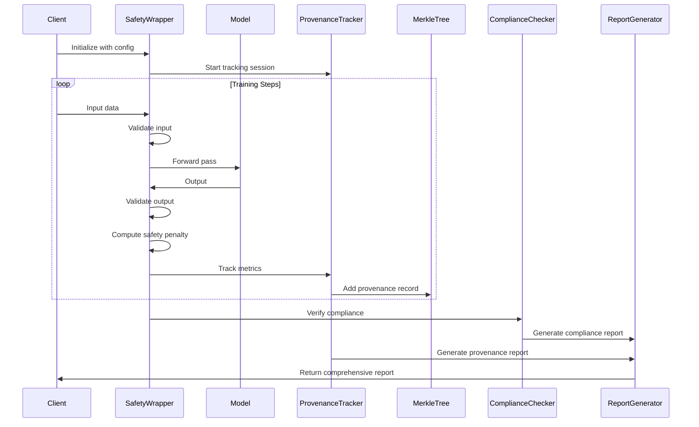
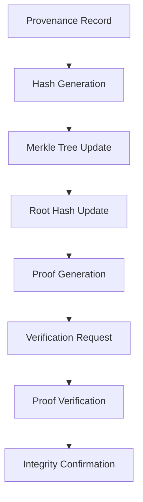

# ML Provenance and Safety Architecture

## Executive Summary

This document presents the architecture for a comprehensive machine learning provenance and safety system designed for production-scale AI deployments. The system provides cryptographic verification of model lineage, automated safety checks, and regulatory compliance across multiple ML frameworks.

## System Architecture Overview

### Core Design Principles

1. **Cryptographic Integrity**: Merkle tree-based provenance verification
2. **Framework Agnostic**: Support for PyTorch, TensorFlow, and JAX
3. **Safety by Design**: Integrated safety mechanisms at every layer
4. **Regulatory Compliance**: Built-in GDPR, CCPA, and industry-specific compliance
5. **Production Ready**: Scalable, fault-tolerant, and monitoring-enabled

### High-Level Architecture

```
┌─────────────────────────────────────────────────────────────┐
│                    ML Provenance & Safety System            │
├─────────────────────────────────────────────────────────────┤
│  Framework Layer (PyTorch/TensorFlow/JAX)                   │
│  ├── Safety Wrappers                                        │
│  ├── Provenance Trackers                                    │
│  └── Compliance Checkers                                    │
├─────────────────────────────────────────────────────────────┤
│  Core Services Layer                                        │
│  ├── Merkle Tree Engine                                     │
│  ├── Safety Validation Engine                               │
│  ├── Privacy Preservation Engine                            │
│  └── Compliance Verification Engine                         │
├─────────────────────────────────────────────────────────────┤
│  Data Layer                                                  │
│  ├── Provenance Storage                                     │
│  ├── Safety Metrics Storage                                 │
│  └── Audit Trail Storage                                    │
└─────────────────────────────────────────────────────────────┘
```

## Core Components

### 1. Framework Integration Layer

#### PyTorch Safety Wrapper
```python
class PyTorchSafetyWrapper:
    def __init__(self, config: SafetyConfig):
        self.config = config
        self.provenance_tracker = ProvenanceTracker()
        self.safety_validator = SafetyValidator()
        
    def validate_input(self, x: torch.Tensor) -> torch.Tensor:
        """Validate input tensor with safety checks"""
        if not isinstance(x, torch.Tensor):
            raise TypeError("Input must be a PyTorch tensor")
            
        # Numerical stability checks
        if torch.isnan(x).any() or torch.isinf(x).any():
            raise ValueError("Input contains NaN or Inf values")
            
        # Safety validation
        x = self.safety_validator.validate_input(x)
        
        # Provenance tracking
        self.provenance_tracker.track_input_stats({
            'mean': x.mean().item(),
            'std': x.std().item(),
            'shape': x.shape,
            'hash': self._compute_hash(x)
        })
        
        return x
        
    def validate_output(self, output: torch.Tensor) -> torch.Tensor:
        """Validate output tensor with safety checks"""
        if not isinstance(output, torch.Tensor):
            raise TypeError("Output must be a PyTorch tensor")
            
        # Numerical stability checks
        if torch.isnan(output).any() or torch.isinf(output).any():
            raise ValueError("Output contains NaN or Inf values")
            
        # Safety validation
        output = self.safety_validator.validate_output(output)
        
        # Provenance tracking
        self.provenance_tracker.track_output_stats({
            'mean': output.mean().item(),
            'std': output.std().item(),
            'shape': output.shape,
            'hash': self._compute_hash(output)
        })
        
        return output
        
    def compute_safety_penalty(self, output: torch.Tensor) -> torch.Tensor:
        """Compute safety violation penalty"""
        penalty = torch.tensor(0.0, device=output.device)
        
        # Distribution checks
        if self.config.check_distribution:
            penalty += self._check_distribution(output)
            
        # Bias checks
        if self.config.check_bias:
            penalty += self._check_bias(output)
            
        # Privacy checks
        if self.config.check_privacy:
            penalty += self._check_privacy(output)
            
        return penalty
```

#### TensorFlow Safety Wrapper
```python
class TensorFlowSafetyWrapper:
    def __init__(self, config: SafetyConfig):
        self.config = config
        self.provenance_tracker = ProvenanceTracker()
        self.safety_validator = SafetyValidator()
        
    @tf.function
    def validate_input(self, inputs: tf.Tensor) -> tf.Tensor:
        """Validate input tensor with safety checks"""
        if not isinstance(inputs, tf.Tensor):
            raise TypeError("Input must be a TensorFlow tensor")
            
        # Numerical stability checks
        if tf.reduce_any(tf.math.is_nan(inputs)) or tf.reduce_any(tf.math.is_inf(inputs)):
            raise ValueError("Input contains NaN or Inf values")
            
        # Safety validation
        inputs = self.safety_validator.validate_input(inputs)
        
        # Provenance tracking
        self.provenance_tracker.track_input_stats({
            'mean': tf.reduce_mean(inputs).numpy(),
            'std': tf.math.reduce_std(inputs).numpy(),
            'shape': inputs.shape,
            'hash': self._compute_hash(inputs)
        })
        
        return inputs
```

#### JAX Safety Wrapper
```python
class JAXSafetyWrapper:
    def __init__(self, config: SafetyConfig):
        self.config = config
        self.provenance_tracker = ProvenanceTracker()
        self.safety_validator = SafetyValidator()
        
    @jax.jit
    def validate_input(self, x: jnp.ndarray) -> jnp.ndarray:
        """Validate input array with safety checks"""
        # JAX-specific validation
        x = self.safety_validator.validate_input(x)
        return x
        
    @jax.jit
    def validate_output(self, output: jnp.ndarray) -> jnp.ndarray:
        """Validate output array with safety checks"""
        # JAX-specific validation
        output = self.safety_validator.validate_output(output)
        return output
```

### 2. Merkle Tree Engine

#### Core Merkle Tree Implementation
```python
class MerkleTree:
    def __init__(self, data: List[bytes]):
        self.data = data
        self.leaves = [hashlib.sha256(item).digest() for item in data]
        self.tree = self._build_tree(self.leaves)
        self.root = self.tree[-1][0] if self.tree else None
        
    def _build_tree(self, leaves: List[bytes]) -> List[List[bytes]]:
        """Build Merkle tree from leaf nodes"""
        if len(leaves) == 0:
            return []
        if len(leaves) == 1:
            return [leaves]
            
        tree = [leaves]
        current_level = leaves
        
        while len(current_level) > 1:
            next_level = []
            for i in range(0, len(current_level), 2):
                if i + 1 < len(current_level):
                    combined = current_level[i] + current_level[i + 1]
                else:
                    combined = current_level[i] + current_level[i]
                next_level.append(hashlib.sha256(combined).digest())
            tree.append(next_level)
            current_level = next_level
            
        return tree
        
    def get_proof(self, index: int) -> List[bytes]:
        """Generate Merkle proof for data at given index"""
        if index >= len(self.leaves):
            raise ValueError("Index out of range")
            
        proof = []
        current_index = index
        
        for level in self.tree[:-1]:
            if current_index % 2 == 0:
                if current_index + 1 < len(level):
                    proof.append(level[current_index + 1])
                else:
                    proof.append(level[current_index])
            else:
                proof.append(level[current_index - 1])
            current_index //= 2
            
        return proof
        
    def verify_proof(self, data: bytes, proof: List[bytes], index: int) -> bool:
        """Verify Merkle proof for given data"""
        current_hash = hashlib.sha256(data).digest()
        current_index = index
        
        for sibling_hash in proof:
            if current_index % 2 == 0:
                combined = current_hash + sibling_hash
            else:
                combined = sibling_hash + current_hash
            current_hash = hashlib.sha256(combined).digest()
            current_index //= 2
            
        return current_hash == self.root
```

#### Provenance Merkle Tree
```python
class ProvenanceMerkleTree:
    def __init__(self):
        self.provenance_records = []
        self.merkle_tree = None
        
    def add_provenance_record(self, record: dict) -> str:
        """Add provenance record and update Merkle tree"""
        record_bytes = self._serialize_record(record)
        record_hash = hashlib.sha256(record_bytes).hexdigest()
        
        self.provenance_records.append({
            'record': record,
            'hash': record_hash,
            'timestamp': datetime.now().isoformat()
        })
        
        self._rebuild_tree()
        return record_hash
        
    def get_provenance_proof(self, record_hash: str) -> dict:
        """Generate proof for specific provenance record"""
        record_index = None
        for i, record in enumerate(self.provenance_records):
            if record['hash'] == record_hash:
                record_index = i
                break
                
        if record_index is None:
            raise ValueError("Record not found")
            
        proof = self.merkle_tree.get_proof(record_index)
        
        return {
            'record_hash': record_hash,
            'proof': [p.hex() for p in proof],
            'root_hash': self.merkle_tree.root.hex(),
            'index': record_index
        }
```

### 3. Safety Validation Engine

#### Bias Detection and Mitigation
```python
class BiasDetector:
    def __init__(self, config: BiasConfig):
        self.config = config
        
    def detect_bias(self, model, data, sensitive_attributes) -> dict:
        """Detect bias in model predictions"""
        predictions = model.predict(data)
        
        return {
            'demographic_parity': self.compute_demographic_parity(predictions, sensitive_attributes),
            'equal_opportunity': self.compute_equal_opportunity(predictions, sensitive_attributes),
            'equalized_odds': self.compute_equalized_odds(predictions, sensitive_attributes),
            'statistical_parity': self.compute_statistical_parity(predictions, sensitive_attributes)
        }
        
    def mitigate_bias(self, model, data, sensitive_attributes) -> Any:
        """Apply bias mitigation techniques"""
        # Implementation of bias mitigation
        return mitigated_model
```

#### Privacy Preservation Engine
```python
class PrivacyPreserver:
    def __init__(self, config: PrivacyConfig):
        self.config = config
        
    def apply_differential_privacy(self, model, data, epsilon: float) -> Any:
        """Apply differential privacy to model training"""
        # Differential privacy implementation
        return privacy_preserved_model
        
    def federated_learning(self, model, distributed_data) -> Any:
        """Implement federated learning for privacy"""
        # Federated learning implementation
        return federated_model
```

### 4. Compliance Verification Engine

#### Regulatory Compliance
```python
class ComplianceChecker:
    def __init__(self, config: ComplianceConfig):
        self.config = config
        
    def check_gdpr_compliance(self, model, data) -> dict:
        """Check GDPR compliance"""
        return {
            'data_minimization': self.check_data_minimization(data),
            'purpose_limitation': self.check_purpose_limitation(data),
            'storage_limitation': self.check_storage_limitation(data),
            'accuracy': self.check_accuracy(model),
            'integrity': self.check_integrity(model),
            'confidentiality': self.check_confidentiality(model)
        }
        
    def check_ccpa_compliance(self, model, data) -> dict:
        """Check CCPA compliance"""
        return {
            'right_to_know': self.check_right_to_know(data),
            'right_to_delete': self.check_right_to_delete(data),
            'right_to_opt_out': self.check_right_to_opt_out(data),
            'financial_incentives': self.check_financial_incentives(data)
        }
```

## Data Flow Architecture

### Training Pipeline with Safety



### Provenance Verification Flow



## Performance and Scalability

### Optimization Strategies

1. **Batch Processing**: Efficient batch-wise provenance tracking
2. **Lazy Evaluation**: On-demand proof generation
3. **Caching**: Cache frequently accessed proofs
4. **Parallel Processing**: Parallel safety checks and validation
5. **Compression**: Compress provenance records for storage efficiency

### Monitoring and Observability

```python
class SystemMonitor:
    def __init__(self):
        self.metrics = {
            'safety': defaultdict(list),
            'provenance': defaultdict(list),
            'compliance': defaultdict(list),
            'performance': defaultdict(list)
        }
        
    def track_metric(self, category: str, name: str, value: float):
        """Track system metrics"""
        self.metrics[category][name].append(value)
        
    def generate_dashboard_data(self) -> dict:
        """Generate dashboard data for monitoring"""
        return {
            'safety_violations': self._analyze_safety_metrics(),
            'provenance_integrity': self._analyze_provenance_metrics(),
            'compliance_status': self._analyze_compliance_metrics(),
            'performance_metrics': self._analyze_performance_metrics()
        }
```

## Security Architecture

### Security Layers

1. **Input Security**: Validation and sanitization
2. **Model Security**: Weight protection and architecture validation
3. **Data Security**: Encryption and access control
4. **Provenance Security**: Cryptographic integrity verification
5. **Compliance Security**: Regulatory adherence verification

### Threat Model

- **Data Tampering**: Mitigated by Merkle tree verification
- **Model Poisoning**: Detected by safety validation
- **Privacy Breaches**: Prevented by privacy preservation
- **Compliance Violations**: Caught by compliance checking

## Deployment Architecture

### Production Deployment

```yaml
# docker-compose.yml
version: '3.8'
services:
  ml-provenance-api:
    image: ml-provenance:latest
    ports:
      - "8000:8000"
    environment:
      - SAFETY_CONFIG_PATH=/config/safety.yaml
      - PROVENANCE_STORAGE_PATH=/data/provenance
      - COMPLIANCE_CONFIG_PATH=/config/compliance.yaml
    volumes:
      - ./config:/config
      - ./data:/data
    depends_on:
      - redis
      - postgres
      
  redis:
    image: redis:7-alpine
    ports:
      - "6379:6379"
      
  postgres:
    image: postgres:15
    environment:
      - POSTGRES_DB=ml_provenance
      - POSTGRES_USER=provenance_user
      - POSTGRES_PASSWORD=secure_password
    volumes:
      - postgres_data:/var/lib/postgresql/data
```

### Kubernetes Deployment

```yaml
# k8s-deployment.yaml
apiVersion: apps/v1
kind: Deployment
metadata:
  name: ml-provenance
spec:
  replicas: 3
  selector:
    matchLabels:
      app: ml-provenance
  template:
    metadata:
      labels:
        app: ml-provenance
    spec:
      containers:
      - name: ml-provenance
        image: ml-provenance:latest
        ports:
        - containerPort: 8000
        env:
        - name: SAFETY_CONFIG_PATH
          value: "/config/safety.yaml"
        - name: PROVENANCE_STORAGE_PATH
          value: "/data/provenance"
        volumeMounts:
        - name: config-volume
          mountPath: /config
        - name: data-volume
          mountPath: /data
      volumes:
      - name: config-volume
        configMap:
          name: ml-provenance-config
      - name: data-volume
        persistentVolumeClaim:
          claimName: ml-provenance-pvc
```

## Integration Patterns

### Framework Integration

```python
# PyTorch Integration
class SafePyTorchModel(nn.Module):
    def __init__(self, config):
        super().__init__()
        self.model = YourModel()
        self.safety_wrapper = PyTorchSafetyWrapper(config)
        
    def forward(self, x):
        x = self.safety_wrapper.validate_input(x)
        output = self.model(x)
        output = self.safety_wrapper.validate_output(output)
        return output

# TensorFlow Integration
class SafeTensorFlowModel(tf.keras.Model):
    def __init__(self, config):
        super().__init__()
        self.model = YourModel()
        self.safety_wrapper = TensorFlowSafetyWrapper(config)
        
    def call(self, inputs, training=False):
        inputs = self.safety_wrapper.validate_input(inputs)
        outputs = self.model(inputs, training=training)
        outputs = self.safety_wrapper.validate_output(outputs)
        return outputs
```

### API Integration

```python
# REST API
@app.post("/train")
async def train_model(request: TrainingRequest):
    safety_system = ProvenanceSafetySystem(request.config)
    model, report = safety_system.train_with_safety(
        request.model, 
        request.data, 
        request.config
    )
    return TrainingResponse(model=model, report=report)

@app.get("/verify/{model_id}")
async def verify_model(model_id: str):
    verifier = ProvenanceValidator()
    result = verifier.validate_provenance(model_id)
    return VerificationResponse(result=result)
```

## Conclusion

This architecture provides a comprehensive, production-ready system for ML provenance and safety. Key features include:

- **Cryptographic Integrity**: Merkle tree-based verification
- **Framework Agnostic**: Support for major ML frameworks
- **Safety by Design**: Integrated safety mechanisms
- **Regulatory Compliance**: Built-in compliance checking
- **Production Ready**: Scalable and monitoring-enabled

The system is designed for advanced AI/ML teams requiring enterprise-grade provenance tracking, safety validation, and regulatory compliance in production environments. 